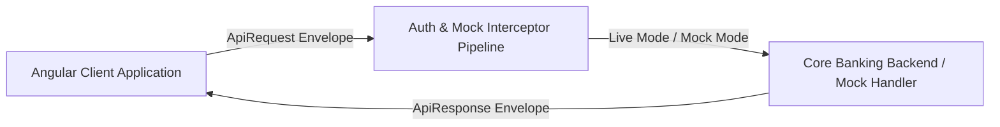

# SSPL Bank API Architecture & Request/Response Context Memory

This document serves as the single source of truth for all API interactions, envelopes, schemas, auth lifecycles, interceptors, and environment configurations across the SSPL Core Banking platform.

---

## 1. Architectural Overview & Envelope Standard

All API requests and responses adhere to an enterprise envelope pattern consisting of a structured **`header`** and optional **`body`**.



### Standard Request Envelope (`ApiRequest<TBody>`)
```json
{
  "header": {
    "requestNo": "REQ122",
    "deviceInfo": {
      "deviceId": "abskc",
      "os": "macOS",
      "osVersion": "14.4"
    },
    "token": "SSPL-AT-...",
    "sessionToken": "SSPL-SES-...",
    "timestamp": "2026-08-22T17:25:00.000Z"
  },
  "body": {}
}
```

### Standard Response Envelope (`ApiResponse<TBody>`)
```json
{
  "header": {
    "requestNo": "REQ122",
    "status": "success",
    "txnId": "1785927966931ZSOFXmXLq2I945728",
    "responseCode": "200",
    "message": "Operation completed successfully"
  },
  "body": {}
}
```

---

## 2. Authentication & Session Lifecycle

```mermaid
sequenceDiagram
    autonumber
    participant UI as Login / Client UI
    participant Session as SessionService
    participant Auth as AuthService
    participant Interceptor as HttpInterceptor
    participant API as Backend (or Mock Interceptor)

    Note over UI, API: Phase 1: Pre-login Session Establishment
    UI->>Session: generateSessionToken()
    Session->>Interceptor: POST /auth/generateSessionToken (Header: DeviceInfo, RequestNo; Body: {})
    Interceptor->>API: Route Request
    API-->>Interceptor: Status: success, txnId, sessionToken & Captcha
    Interceptor-->>Session: Return SessionTokenResponse
    Session-->>UI: Display Captcha with Noise Lines

    Note over UI, API: Phase 1b: Bank List (Post session-token, pre-login)
    UI->>Interceptor: POST /auth/bankList (Body: {})
    API-->>UI: bankListResponse with banks[], tenantId, bankName & theme colors
    UI->>UI: Populate bank dropdown + apply selected bank theme to CSS variables

    Note over UI, API: Phase 2: Login & Token Creation
    UI->>Auth: login(tenant, customerId, sessionToken)
    Auth->>Interceptor: POST /auth/login
    Interceptor->>API: Route Login with SessionToken
    API-->>Interceptor: Return AccessToken, RefreshToken & User Details
    Interceptor-->>Auth: Save Tokens in Signals & SessionStorage
    Auth-->>UI: Navigate to Dashboard

    Note over UI, API: Phase 3: Authenticated Calls
    UI->>Interceptor: GET /dashboard/summary
    Interceptor->>Interceptor: Inject Bearer Token & X-Session-Token Headers
    Interceptor->>API: Fetch Dashboard Data
    API-->>UI: Return Summary / Accounts / Transactions

    Note over UI, API: Phase 4: Token Rotation
    Auth->>Interceptor: POST /auth/refreshToken (Body: refreshToken, sessionToken)
    API-->>Auth: New AccessToken + RefreshToken

    Note over UI, API: Phase 5: Logout
    Auth->>Interceptor: POST /auth/logout
    API-->>Auth: Invalidate Session
```

---

## 3. Detailed API Endpoint Specifications

### 3.1. Generate Session Token (Pre-Login)
- **Endpoint**: `POST /auth/generateSessionToken`
- **Purpose**: Generates a secure server session token before authentication and supplies challenge data (Captcha code, noise lines) to prevent automated bot attacks.
- **Trigger**: Invoked automatically on Login page initialization or when refreshing captcha.

#### Request Example
```json
{
  "header": {
    "requestNo": "REQ122",
    "deviceInfo": {
      "deviceId": "abskc",
      "os": "jhbca",
      "osVersion": "917"
    }
  },
  "body": {}
}
```

#### Response Example
```json
{
  "header": {
    "requestNo": "REQ122",
    "status": "success",
    "txnId": "1785927966931ZSOFXmXLq2I945728"
  },
  "body": {
    "sessionToken": "SSPL-SES-TC938-1785927966931",
    "expiresAt": 1785928866931,
    "captchaCode": "TCWYXg",
    "noiseLines": [
      { "x1": 5, "y1": 15, "x2": 135, "y2": 25, "color": "rgba(13, 34, 64, 0.25)" },
      { "x1": 10, "y1": 30, "x2": 130, "y2": 10, "color": "rgba(201, 162, 39, 0.35)" },
      { "x1": 20, "y1": 8, "x2": 120, "y2": 32, "color": "rgba(13, 34, 64, 0.20)" }
    ]
  }
}
```

---

### 3.2. Bank List (Post Session-Token, Pre-Login)
- **Endpoint**: `POST /auth/bankList`
- **Purpose**: Returns the list of available banks with their `tenantId`, display name, and full theme configuration (`headerBgColor`, `menuBgColor`, `footerBgColor`). Called immediately after a successful `generateSessionToken` response so the bank dropdown is populated before the user interacts with the form.
- **Theme Application**: On selecting a bank, `ThemeService` applies `--color-brand-primary` and related CSS variables to `document.documentElement` dynamically. The change is instant and persists across the login → dashboard navigation via `sessionStorage`.

#### Request Example
```json
{
  "header": {
    "requestNo": "REQ122",
    "deviceInfo": {
      "deviceId": "abskc",
      "os": "jhbca",
      "osVersion": "917"
    }
  },
  "body": {}
}
```

#### Response Example
```json
{
  "header": {
    "requestNo": "REQ122",
    "status": "success",
    "txnId": "1787289005903DdnFT4GJcI76943b0"
  },
  "body": {
    "bankListResponse": {
      "banks": [
        {
          "bankCode": "BHARAT",
          "bankShortCode": "BHAR",
          "tenantId": "TENANTBHARAT",
          "bankName": "Bharat Bank",
          "theme": {
            "headerBgColor": "#082F49",
            "menuBgColor": "#075985",
            "footerBgColor": "#041F31"
          }
        },
        {
          "bankCode": "DNS",
          "bankShortCode": "DNSB",
          "tenantId": "TENANTDNS",
          "bankName": "DNS Bank",
          "theme": {
            "headerBgColor": "#166534",
            "menuBgColor": "#14532D",
            "footerBgColor": "#052E16"
          }
        }
      ]
    }
  }
}
```

#### Theme CSS Variables Applied (by `ThemeService`)
| CSS Variable | Source Field | Effect |
|---|---|---|
| `--color-brand-primary` | `headerBgColor` | Login header, nav bar background |
| `--color-brand-primary-hover` | `headerBgColor` + lighten | Button hover state |
| `--color-bg-inverse` | `headerBgColor` | Inverted surface background |
| `--sspl-menu-bg` | `menuBgColor` | Sidebar/navigation background |
| `--sspl-footer-bg` | `footerBgColor` | Footer section background |

---

### 3.3. Customer Login
- **Endpoint**: `POST /auth/login`
- **Purpose**: Authenticates credentials within the active session token and generates corresponding access and refresh tokens.
- **Trigger**: Invoked when user submits the login form.

#### Request Example
```json
{
  "header": {
    "requestNo": "REQ123",
    "deviceInfo": {
      "deviceId": "abskc",
      "os": "macOS",
      "osVersion": "14.4"
    },
    "sessionToken": "SSPL-SES-TC938-1785927966931"
  },
  "body": {
    "tenantId": "SSPL001",
    "customerId": "SSPL_USER_84920",
    "password": "SecurePassword@2026!",
    "captchaCode": "TCWYXg",
    "sessionToken": "SSPL-SES-TC938-1785927966931"
  }
}
```

#### Response Example
```json
{
  "header": {
    "requestNo": "REQ123",
    "status": "success",
    "txnId": "1785927967812ABXZyKl823091"
  },
  "body": {
    "accessToken": "SSPL-AT-90A81BC-1785927967",
    "refreshToken": "SSPL-RT-44D12EF-1785927967",
    "sessionToken": "SSPL-SES-TC938-1785927966931",
    "expiresIn": 900,
    "tokenType": "Bearer",
    "user": {
      "id": "SSPL_USER_84920",
      "name": "Rajesh K. Sharma",
      "username": "SSPL_USER_84920",
      "tenant": "SSPL001",
      "lastLogin": "08 Jun, 09:41",
      "avatarInitials": "RK",
      "role": "Personal Banking"
    }
  }
}
```

---

### 3.3. Refresh Token
- **Endpoint**: `POST /auth/refreshToken`
- **Purpose**: Generates a new short-lived access token and rotated refresh token when access token expires.

#### Request Example
```json
{
  "header": {
    "requestNo": "REQ124",
    "deviceInfo": { "deviceId": "abskc", "os": "macOS", "osVersion": "14.4" },
    "sessionToken": "SSPL-SES-TC938-1785927966931"
  },
  "body": {
    "refreshToken": "SSPL-RT-44D12EF-1785927967",
    "sessionToken": "SSPL-SES-TC938-1785927966931"
  }
}
```

#### Response Example
```json
{
  "header": {
    "requestNo": "REQ124",
    "status": "success",
    "txnId": "1785927969012LKJXyQl983210"
  },
  "body": {
    "accessToken": "SSPL-AT-7889A12-1785927969",
    "refreshToken": "SSPL-RT-3391BC1-1785927969",
    "expiresIn": 900,
    "tokenType": "Bearer"
  }
}
```

---

### 3.4. Logout
- **Endpoint**: `POST /auth/logout`
- **Purpose**: Revokes the active session token, access token, and refresh token on the server.

#### Request Example
```json
{
  "header": {
    "requestNo": "REQ125",
    "deviceInfo": { "deviceId": "abskc", "os": "macOS", "osVersion": "14.4" },
    "sessionToken": "SSPL-SES-TC938-1785927966931"
  },
  "body": {
    "sessionToken": "SSPL-SES-TC938-1785927966931"
  }
}
```

#### Response Example
```json
{
  "header": {
    "requestNo": "REQ125",
    "status": "success",
    "txnId": "1785927970001ZSOFXmXLq2I945728"
  },
  "body": {
    "message": "Session terminated and tokens invalidated successfully"
  }
}
```

---

### 3.5. Line of Business List API
- **Endpoint**: `POST /auth/getLobList`
- **Purpose**: Fetches dynamically available Lines of Business (LOBs) for a given bank code.
- **Trigger**: Invoked during registration upon bank selection.

#### Request Example
```json
{
  "header": {
    "requestNo": "REQ122",
    "deviceInfo": {
      "deviceId": "abskc",
      "os": "macOS",
      "osVersion": "14.4"
    }
  },
  "body": {
    "lobRequest": {
      "bankCode": "BHARAT"
    }
  }
}
```

#### Response Example
```json
{
  "header": {
    "requestNo": "REQ122",
    "status": "success",
    "txnId": "17872891747689LKHkHsLDvT6943b0"
  },
  "body": {
    "lobListResponse": {
      "bankCode": "BHARAT",
      "lobs": [
        { "lobCode": "RETAIL", "lobName": "Retail Banking" },
        { "lobCode": "CORPORATE", "lobName": "Corporate Banking" },
        { "lobCode": "SME", "lobName": "SME Banking" },
        { "lobCode": "AGRICULTURE", "lobName": "Agriculture Banking" }
      ]
    }
  }
}
```

---

### 3.6. User Registration API
- **Endpoint**: `POST /auth/register`
- **Purpose**: Onboards new customer credentials with bankCode, lobCode, username, mobileNumber, password, and customerId.

#### Request Example
```json
{
  "header": {
    "requestNo": "REQ122",
    "deviceInfo": {
      "browser": "Google",
      "browserVersion": "12345560.150150.5115"
    }
  },
  "body": {
    "registerRequest": {
      "bankCode": "BHARAT",
      "lobCode": "RETAIL",
      "username": "vishal123",
      "mobileNumber": "8884045346",
      "password": "Vishal@123",
      "customerId": "BHARAT-CUST-10003"
    }
  }
}
```

#### Response Example
```json
{
  "header": {
    "requestNo": "REQ122",
    "status": "success",
    "txnId": "1787289621927rBoSezoMcEC6943b0"
  },
  "body": {
    "registrationResponse": {
      "bankCode": "BHARAT",
      "customerId": "BHARAT-CUST-10003",
      "tenantId": "TENANTBHARAT",
      "userReference": "USER-BHAR-0019",
      "lobCode": "RETAIL",
      "userId": 500000000019,
      "channelId": 9001,
      "username": "vishal123"
    }
  }
}
```

---

### 3.7. User Profile API
- **Endpoint**: `POST /auth/profile`
- **Purpose**: Retrieves the customer's personal credentials, registered bank, and line of business. The frontend uses this to display customer banking details (Account numbers, IFSC, LOB, Username, Mobile number) while strictly excluding internal tenant identifiers (`tenantId`, `userReference`).

#### Request Example
```json
{
  "header": {
    "requestNo": "REQ122",
    "deviceInfo": {
      "browser": "Google",
      "browserVersion": "12345560.150150.5115"
    }
  },
  "body": {}
}
```

#### Response Example
```json
{
  "header": {
    "requestNo": "REQ122",
    "status": "success",
    "txnId": "1787290034331bkazlwbzyv16943b0"
  },
  "body": {
    "profileResponse": {
      "bankCode": "BHARAT",
      "mobileNumber": "8884045346",
      "customerId": "BHARAT-CUST-10003",
      "tenantId": "TENANTBHARAT",
      "userReference": "USER-BHAR-0019",
      "lobCode": "RETAIL",
      "username": "vishal123"
    }
  }
}
```

---

### 3.8. Dashboard Endpoints
- `GET /dashboard/summary` — Returns consolidated financial balances and credit/debit KPIs.
- `GET /dashboard/accounts` — Returns list of accounts (Savings, Current, NRI, FDs).
- `GET /dashboard/transactions` — Returns recent transaction ledger items.
- `GET /dashboard/accounts/:id/refresh` — Triggers account balance refresh with core banking switch.

---

### 3.9. Balance Enquiry API
- **Endpoint**: `POST /dashboard/balanceEnquiry`
- **Purpose**: Returns real-time ledger and available balances, currencies, masked account numbers, and account types across all linked customer accounts.
- **Trigger**: Invoked when customer clicks "Balance Enquiry" on the dashboard or navigates to `/balance-enquiry`.

#### Request Example
```json
{
  "header": {
    "requestNo": "REQ122",
    "deviceInfo": {
      "browser": "Google",
      "browserVersion": "12345560.150150.5115"
    }
  },
  "body": {}
}
```

#### Response Example
```json
{
  "header": {
    "requestNo": "REQ122",
    "status": "success",
    "txnId": "1787289836691OT7EmimVALC6943b0"
  },
  "body": {
    "balanceResponse": {
      "correlationId": "REQ122",
      "accounts": [
        {
          "ledgerBalance": 77975,
          "accountType": "CURRENT",
          "accountNumberMasked": "XXXXXXXX0003",
          "currency": "INR",
          "availableBalance": 2324460
        }
      ]
    }
  }
}
```

---

## 4. HTTP Interceptors Architecture

### 1. `authInterceptor` (`src/app/core/interceptors/auth.interceptor.ts`)
- Automatically resolves relative API paths against `environment.apiBaseUrl`.
- Injects HTTP headers:
  - `Authorization: Bearer <accessToken>`
  - `X-Session-Token: <sessionToken>`
  - `X-Device-Id: <deviceId>`
- Listens for `401 Unauthorized` responses to trigger token rotation or logout.

### 2. `mockApiInterceptor` (`src/app/core/interceptors/mock-api.interceptor.ts`)
- Active when `environment.useMockApi === true`.
- Intercepts requests and returns realistic payloads wrapped in the standard `ApiResponse` envelope.
- Emulates asynchronous backend network delays using RxJS `delay(environment.mockDelayMs)`.

---

## 5. Switching from Mock to Live Backend

To point the application to your actual backend server:

Open `src/environments/environment.ts` and adjust the two properties:

```typescript
export const environment = {
  production: false,
  // 1. Set your backend base URL:
  apiBaseUrl: 'https://your-actual-api-domain.com/api/v1',
  // 2. Set useMockApi to false:
  useMockApi: false,
  mockDelayMs: 0,
  apiVersion: 'v1',
  appVersion: '1.0.0'
};
```

That's it! When `useMockApi` is `false`, `mockApiInterceptor` immediately passes all requests through to the live server URL with all auth headers and envelopes intact.
