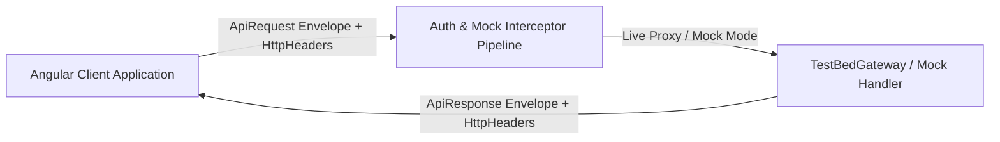
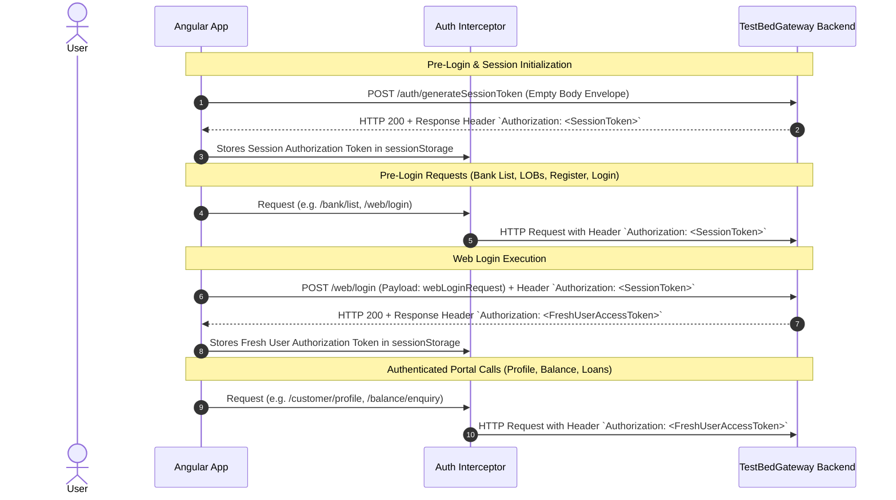

# SSPL Core Banking API Architecture & Request/Response Reference

This document serves as the single source of truth for all API interactions, envelopes, schemas, auth lifecycles, proxy routing, interceptors, and environment configurations across the SSPL Core Banking platform.

---

## 1. Gateway & Proxy Configuration

- **Proxy Target**: `http://10.10.213.33:91/`
- **Proxy Context Path**: `/TestBedGateway`
- **API Base URL**: `/TestBedGateway/API/banking`
- **Proxy Config File**: `proxy.conf.json`
- **Angular Dev Server Config**: `angular.json` under `projects.sspl-demo.architect.serve.options.proxyConfig`.

```json
{
  "/TestBedGateway": {
    "target": "http://10.10.213.33:91",
    "secure": false,
    "changeOrigin": true,
    "logLevel": "debug"
  }
}
```

---

## 2. Architectural Overview & Envelope Standard

All API requests and responses adhere to an enterprise envelope pattern consisting of a structured **`header`** and **`body`**.



### Standard Request Envelope (`ApiRequest<TBody>`)
```json
{
  "header": {
    "requestNo": "REQ122",
    "deviceInfo": {
      "browser": "Google",
      "browserVersion": "12345560.150150.5115"
    }
  },
  "body": {}
}
```

### Standard Response Envelope (Success) (`ApiResponse<TBody>`)
```json
{
  "header": {
    "requestNo": "REQ122",
    "status": "success",
    "txnId": "1787579580999y2fZvxpN0ZU6943b0"
  },
  "body": {}
}
```

### Standard Response Envelope (Error)
```json
{
  "header": {
    "errorMessage": "Customer is already registered",
    "errorCode": "5206",
    "requestNo": "REQ122",
    "status": "error",
    "txnId": "1787579580999y2fZvxpN0ZU6943b0"
  }
}
```

---

## 3. Authentication & HTTP Authorization Header Lifecycle



### Key Security & Transport Rules:
1. **HTTP Headers vs. Body Headers**:
   - `Authorization` tokens are **NOT** passed inside the JSON request body or JSON `header` object.
   - All authorization tokens are transmitted strictly via the **HTTP Request Headers**: `Authorization: Bearer <token>` or `Authorization: <token>`.
2. **Session Token Capture**:
   - Calling `POST /auth/generateSessionToken` returns a pre-login `Authorization` HTTP response header.
   - This header is automatically captured and used for subsequent pre-login requests (`bank/list`, `customer/bank/list`, `lob/list`, `customer/register`, `web/login`).
3. **Login Token Rotation**:
   - Calling `POST /web/login` authenticates the user and returns a fresh `Authorization` HTTP response header.
   - This fresh token is automatically stored and applied to all subsequent authenticated API calls (`balance/enquiry`, `customer/profile`, loan applications).

---

## 4. Endpoints Specification

### 4.0 Generate Session Token API
- **Endpoint**: `POST /TestBedGateway/API/banking/auth/generateSessionToken`
- **Description**: Pre-login initialization to generate session token, captcha code, and captcha noise lines.
- **HTTP Response Header**: `Authorization: <SessionToken>`

#### Request
```json
{
  "header": {
    "requestNo": "REQ122",
    "deviceInfo": {
      "browser": "Google",
      "browserVersion": "12345560.150150.5115"
    }
  },
  "body": {}
}
```

#### Response
```json
{
  "header": {
    "requestNo": "REQ122",
    "status": "success",
    "txnId": "1787579471378iX6v11s5gpa6943b0"
  },
  "body": {
    "sessionToken": "SSPL-SES-DEFAULT",
    "expiresAt": 1787580371378,
    "captchaCode": "TCWYXg",
    "noiseLines": [
      { "x1": 5, "y1": 15, "x2": 135, "y2": 25, "color": "rgba(13, 34, 64, 0.25)" }
    ]
  }
}
```

---

### 4.1 Bank List API
- **Endpoint**: `POST /TestBedGateway/API/banking/bank/list`
- **Description**: Fetches all onboarded banks, their tenant IDs, and UI theme color definitions.
- **HTTP Request Header**: `Authorization: <SessionToken>`

#### Request
```json
{
  "header": {
    "requestNo": "REQ122",
    "deviceInfo": {
      "browser": "Google",
      "browserVersion": "12345560.150150.5115"
    }
  },
  "body": {}
}
```

#### Response
```json
{
  "header": {
    "requestNo": "REQ122",
    "status": "success",
    "txnId": "1787579471378iX6v11s5gpa6943b0"
  },
  "body": {
    "bankListResponse": {
      "banks": [
        {
          "bankId": "BANK0001",
          "tenantId": "TENANT0001",
          "bankName": "Bharat Sahakari Bank Ltd",
          "theme": {
            "footerText": "#041F31",
            "primaryColor": "#082F49",
            "secondaryColor": "#075985"
          },
          "shortName": "BHAR"
        },
        {
          "bankId": "BANK0003",
          "tenantId": "TENANT0003",
          "bankName": "Cosmos Cooperative Bank Ltd",
          "theme": {
            "footerText": "#431407",
            "primaryColor": "#9A3412",
            "secondaryColor": "#7C2D12"
          },
          "shortName": "CCBL"
        },
        {
          "bankId": "BANK0002",
          "tenantId": "TENANT0002",
          "bankName": "DNS Bank",
          "theme": {
            "footerText": "#052E16",
            "primaryColor": "#166534",
            "secondaryColor": "#14532D"
          },
          "shortName": "DNS"
        },
        {
          "bankId": "BANK0004",
          "tenantId": "TENANT0004",
          "bankName": "Jalgaon Janata Bank Ltd",
          "theme": {
            "footerText": "#422006",
            "primaryColor": "#854D0E",
            "secondaryColor": "#A16207"
          },
          "shortName": "JJBL"
        },
        {
          "bankId": "BANK0005",
          "tenantId": "TENANT0005",
          "bankName": "Karad Urban Cooperative Bank",
          "theme": {
            "footerText": "#1E1B4B",
            "primaryColor": "#312E81",
            "secondaryColor": "#4338CA"
          },
          "shortName": "KUCB"
        }
      ]
    }
  }
}
```

---

### 4.2 Lines of Business (LOB) List API
- **Endpoint**: `POST /TestBedGateway/API/banking/lob/list`
- **Description**: Fetches supported Lines of Business for a specified bank.
- **HTTP Request Header**: `Authorization: <SessionToken>`

#### Request
```json
{
  "header": {
    "requestNo": "REQ122",
    "deviceInfo": {
      "browser": "Google",
      "browserVersion": "12345560.150150.5115"
    }
  },
  "body": {
    "lobRequest": {
      "bankId": "BANK0001"
    }
  }
}
```

#### Response
```json
{
  "header": {
    "requestNo": "REQ122",
    "status": "success",
    "txnId": "1787579505096MPCGaOvT1Ji6943b0"
  },
  "body": {
    "lobListResponse": {
      "bankId": "BANK0001",
      "lobs": [
        {
          "lobCode": "RETAIL",
          "lobName": "Retail Banking"
        },
        {
          "lobCode": "AGRICULTURE",
          "lobName": "Agriculture Banking"
        }
      ]
    }
  }
}
```

---

### 4.3 Customer Bank List API
- **Endpoint**: `POST /TestBedGateway/API/banking/customer/bank/list`
- **Description**: Fetches list of banks registered with a specific customer mobile number.
- **HTTP Request Header**: `Authorization: <SessionToken>`

#### Request
```json
{
  "header": {
    "requestNo": "REQ122",
    "deviceInfo": {
      "browser": "Google",
      "browserVersion": "12345560.150150.5115"
    }
  },
  "body": {
    "customerBankRequest": {
      "mobileNumber": "9766588867"
    }
  }
}
```

#### Response
```json
{
  "header": {
    "requestNo": "REQ122",
    "status": "success",
    "txnId": "1787579549288epLtgAzJR0a6943b0"
  },
  "body": {
    "customerBankListResponse": {
      "banks": [
        {
          "bankId": "BANK0001",
          "tenantId": "TENANT0001",
          "bankName": "Bharat Sahakari Bank Ltd",
          "shortName": "BHAR"
        },
        {
          "bankId": "BANK0003",
          "tenantId": "TENANT0003",
          "bankName": "Cosmos Cooperative Bank Ltd",
          "shortName": "CCBL"
        },
        {
          "bankId": "BANK0005",
          "tenantId": "TENANT0005",
          "bankName": "Karad Urban Cooperative Bank",
          "shortName": "KUCB"
        }
      ]
    }
  }
}
```

---

### 4.4 Customer Registration API
- **Endpoint**: `POST /TestBedGateway/API/banking/customer/register`
- **Description**: Registers a new customer into the banking platform.
- **HTTP Request Header**: `Authorization: <SessionToken>`

#### Request
```json
{
  "header": {
    "requestNo": "REQ122",
    "deviceInfo": {
      "browser": "Google",
      "browserVersion": "12345560.150150.5115"
    }
  },
  "body": {
    "registerRequest": {
      "customerId": "JALGAON-CUST-10001",
      "username": "sagar123",
      "firstName": "Sagar",
      "lastName": "Koli",
      "bankId": "BANK0004",
      "lobCode": "RETAIL",
      "mobileNumber": "8898832785",
      "password": "Sagar@123"
    }
  }
}
```

#### Response (Success)
```json
{
  "header": {
    "requestNo": "REQ122",
    "status": "success",
    "txnId": "1787579580999y2fZvxpN0ZU6943b0"
  },
  "body": {
    "registrationResponse": {
      "bankId": "BANK0004",
      "customerId": "JALGAON-CUST-10001",
      "tenantId": "TENANT0004",
      "userReference": "USER-JJBL-0022",
      "lobCode": "RETAIL",
      "userId": 50000000000012,
      "channelId": 9001,
      "username": "sagar123",
      "firstName": "Sagar",
      "lastName": "Koli"
    }
  }
}
```

#### Response (Error)
```json
{
  "header": {
    "errorMessage": "Customer is already registered",
    "errorCode": "5206",
    "requestNo": "REQ122",
    "status": "error",
    "txnId": "1787579580999y2fZvxpN0ZU6943b0"
  }
}
```

---

### 4.5 Web Login API
- **Endpoint**: `POST /TestBedGateway/API/banking/web/login`
- **Description**: Authenticates a user into the web banking portal.
- **HTTP Request Header**: `Authorization: <SessionToken>`
- **HTTP Response Header**: `Authorization: <FreshUserAccessToken>`

#### Request
```json
{
  "header": {
    "requestNo": "REQ122",
    "deviceInfo": {
      "browser": "Google",
      "browserVersion": "12345560.150150.5115"
    }
  },
  "body": {
    "webLoginRequest": {
      "bankId": "BANK0004",
      "username": "sagar123",
      "password": "Sagar@123"
    }
  }
}
```

#### Response
```json
{
  "header": {
    "requestNo": "REQ122",
    "status": "success",
    "txnId": "1787579616199JfsFCWGptji6943b0"
  },
  "body": {
    "status": 1
  }
}
```

---

### 4.6 Balance Enquiry API
- **Endpoint**: `POST /TestBedGateway/API/banking/balance/enquiry`
- **Description**: Retrieves real-time account balances, ledger balances, and masked account identifiers.
- **HTTP Request Header**: `Authorization: <FreshUserAccessToken>`

#### Request
```json
{
  "header": {
    "requestNo": "REQ122",
    "deviceInfo": {
      "browser": "Google",
      "browserVersion": "12345560.150150.5115"
    }
  },
  "body": {}
}
```

#### Response
```json
{
  "header": {
    "requestNo": "REQ122",
    "status": "success",
    "txnId": "17875796443491f42d2a45055455"
  },
  "body": {
    "balanceResponse": {
      "correlationId": "REQ122",
      "accounts": [
        {
          "ledgerBalance": 72500.75,
          "accountType": "SAVINGS",
          "accountNumberMasked": "XXXXXXXX0001",
          "currency": "INR",
          "availableBalance": 72000.75
        },
        {
          "ledgerBalance": 127975,
          "accountType": "CURRENT",
          "accountNumberMasked": "XXXXXXXX0002",
          "currency": "INR",
          "availableBalance": 324460
        }
      ],
      "transactionId": "17875796443491f42d2a45055455"
    }
  }
}
```

---

### 4.7 Customer Profile API
- **Endpoint**: `POST /TestBedGateway/API/banking/customer/profile`
- **Description**: Returns personal and banking profile information for the authenticated user.
- **HTTP Request Header**: `Authorization: <FreshUserAccessToken>`

#### Request
```json
{
  "header": {
    "requestNo": "REQ122",
    "deviceInfo": {
      "browser": "Google",
      "browserVersion": "12345560.150150.5115"
    }
  },
  "body": {}
}
```

#### Response
```json
{
  "header": {
    "requestNo": "REQ122",
    "status": "success",
    "txnId": "1787579671161AyBqMNZPEDi6943b0"
  },
  "body": {
    "profileResponse": {
      "firstName": "Sagar",
      "lastName": "Koli",
      "bankId": "BANK0004",
      "mobileNumber": "8898832785",
      "customerId": "JALGAON-CUST-10001",
      "tenantId": "TENANT0004",
      "fullName": "Sagar Koli",
      "bankName": "Jalgaon Janata Bank Ltd",
      "userReference": "USER-JJBL-0022",
      "lobCode": "RETAIL",
      "username": "sagar123"
    }
  }
}
```
